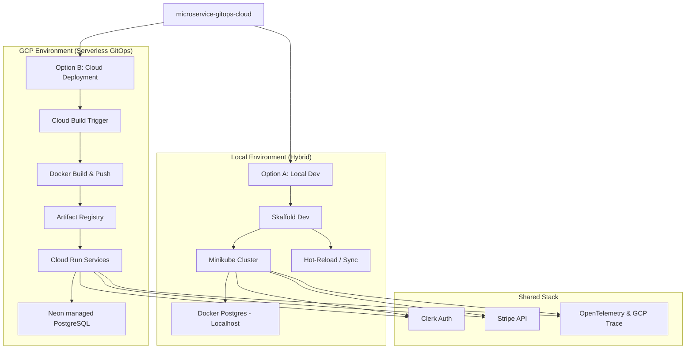

# Slick Shop: Microservices Monorepo

A professional, high-performance microservices platform architected with **Next.js 15**, **NestJS 11**, and **Google Cloud Platform (GCP)**.

## 🗺 System Architecture & Workflow



Building microservices is notoriously difficult. This project solves four primary pain points:

1.  **Monolithic Complexity in Microservices**: Most monorepos suffer from "dependency hell." We solve this by using **npm workspaces** and shared packages (`@repo/database`, `@repo/otel`) to ensure clean separation while maintaining code reuse.
2.  **Slow Local Development Feedback Loops**: Waiting for Docker builds during development is a productivity killer. We use **Skaffold** for instant hot-reloading within a local Kubernetes cluster.
3.  **Complex Infrastructure Management**: Managing GKE clusters can be overwhelmed. We utilize **GCP Cloud Run** for a serverless, "pay-as-you-go" scaling model that abstracts infrastructure management.
4.  **Inconsistent Environment Parity**: "It works on my machine" is solved by using identical configuration patterns across local development and production environments.

## 🛠 Component Utility

| Component | Technology | Purpose |
| :--- | :--- | :--- |
| **Frontend** | Next.js 15 | Premium UI/UX with Server Components and dynamic rewrites. |
| **Payment Service** | NestJS | Securely handles Stripe Checkout and Webhooks. |
| **Order Service** | NestJS | Manages order lifecycle and database persistence. |
| **Shared DB** | Prisma & Neon | Managed PostgreSQL with typesafe Prisma access. |
| **Observability** | OTel | End-to-end distributed tracing via Google Cloud Trace. |
| **Infrastructure** | Cloud Build | GitOps-driven serverless deployment to Cloud Run. |

---

## 🚀 Getting Started

### 📋 Prerequisites

Before you begin, ensure you have the following tools installed:

- **Node.js 20+** and **npm**
- **Docker Desktop**
- **Terraform**
- **Minikube** (for local K8s)
- **Skaffold** (for local development orchestration)
- **Google Cloud CLI** (only for Option B: Cloud Mode)

---

### 🔐 1. Authentication Setup (Clerk)

This project uses **Clerk** for authentication. You need to set up a Clerk account and obtain your API keys.

1.  Create a new application at [clerk.com](https://clerk.com).
2.  In each service's `.env` file (see `apps/shop/.env.example`, etc.), add your keys:
    ```env
    NEXT_PUBLIC_CLERK_PUBLISHABLE_KEY=pk_test_...
    CLERK_SECRET_KEY=sk_test_...
    ```

---

### 💻 2. Option A: Local Development Setup

This is the fastest way to get started using **Docker** and **Minikube**.

#### Step 1: Initialize Local Database
Spins up a local PostgreSQL container using Docker via Terraform.
```bash
cd infrastructure/terraform
terraform init
terraform apply -var="db_password=YOUR_PASSWORD" -var="use_gcp=false" -var="project_id=mock"
# Note: The database will be available at localhost:5432
```

#### Step 2: Initialize Database Schema
Run Prisma migrations to create the tables in your local database.
```bash
cd ../../packages/database
npm install
npx prisma migrate dev
```

#### Step 3: Launch Cluster & Hot-Reload
Ensure Minikube is running, then use Skaffold to deploy everything.
```bash
minikube start --driver=docker
skaffold dev
```
> [!TIP]
> `skaffold dev` will build your images, deploy them to Minikube, and set up port-forwarding. You can then access the **Shop** UI at `http://localhost:3000`.

---

### 🌩 2. Option B: GCP Cloud Deployment

This project uses a serverless GitOps approach with **Cloud Run** and **Cloud Build**.

#### Step 1: GCP Authentication
Log in to GCP and set your project.
```bash
gcloud auth login
gcloud config set project YOUR_PROJECT_ID
```

#### Step 2: Manual Deployment (First Time)
Submit the build to Cloud Build with the necessary secrets as substitutions.
```bash
gcloud builds submit --config cloudbuild.yaml \
  --substitutions=_DATABASE_URL="...",_CLERK_SECRET_KEY="...",_STRIPE_SECRET_KEY="..." .
```

#### Step 3: Automated GitOps (Continuous Deployment)
1. Go to **Cloud Build Triggers** in the GCP Console.
2. Connect this repository to GitHub.
3. Create a trigger that executes `cloudbuild.yaml` on every push to `main`.
4. Add all required secrets to the trigger's **Substitutions** block.

---

## 🔍 Advanced Features

### Distributed Tracing (OTel)
The project includes a shared `@repo/otel` package that automatically propagates trace contexts across services. In production, traces are exported directly to **Google Cloud Trace**, providing a full waterfall view of request execution.

### GitOps Workflow
Any changes pushed to the `main` branch trigger a Cloud Build execution. The pipeline builds new Docker images, pushes them to the Artifact Registry, and performs a zero-downtime deployment to Cloud Run.
