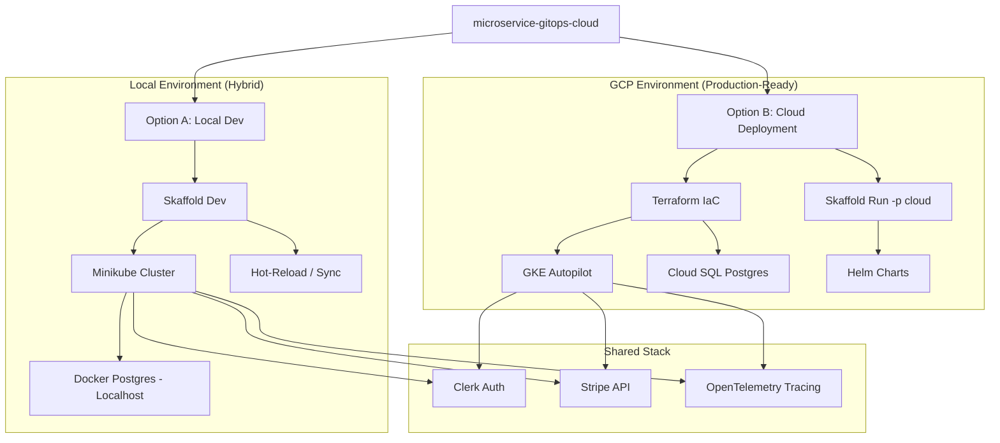

# microservice-gitops-cloud

A high-performance, developer-first microservices platform built with **Next.js 15**, **NestJS 11**, and **Google Cloud Platform (GCP)**.

## 🗺 System Architecture & Workflow



## 🎯 The Problems We Solve

Building microservices is notoriously difficult. This project solves four primary pain points:

1.  **Monolithic Complexity in Microservices**: Most monorepos suffer from "dependency hell." We solve this by using **npm workspaces** and shared packages (`@repo/database`, `@repo/otel`) to ensure clean separation while maintaining code reuse.
2.  **Slow Local Development Feedback Loops**: Waiting for Docker builds during development is a productivity killer. We use **Skaffold** for instant hot-reloading within a local Kubernetes cluster.
3.  **High Cloud Costs for Labs/Dev**: Cloud bills can skyrocket. Our infrastructure is engineered for **Zero Cost** using GCP's Free Tier and Cloud SQL's smallest instance sizes.
4.  **Inconsistent Environment Parity**: "It works on my machine" is solved by using identical **Helm charts** and **Kubernetes manifests** for both local dev and production.

## 🛠 Component Utility

| Component | Technology | Purpose |
| :--- | :--- | :--- |
| **Frontend** | Next.js 15 | Premium UI/UX with Server Components for SEO and speed. |
| **Payment Service** | NestJS | Securely handles Stripe Checkout and Webhooks. |
| **Order Service** | NestJS | Manages order lifecycle and database persistence. |
| **Shared DB** | Prisma | Typesafe database access shared across all backend services. |
| **Observability** | OTel | End-to-end distributed tracing to debug across service boundaries. |
| **Infrastructure** | Terraform | Reproducible GCP environment (VPC, SQL, GKE). |

---

## 🚀 Getting Started

### 📋 Prerequisites

Before you begin, ensure you have the following tools installed:

- **Node.js 20+** and **npm**
- **Docker Desktop**
- **Terraform**
- **Minikube** (for local K8s)
- **Skaffold** (for local development orchestration)
- **Google Cloud CLI** (only for Option B: Cloud Mode)

---

### 🔐 1. Authentication Setup (Clerk)

This project uses **Clerk** for authentication. You need to set up a Clerk account and obtain your API keys.

1.  Create a new application at [clerk.com](https://clerk.com).
2.  In each service's `.env` file (see `apps/shop/.env.example`, etc.), add your keys:
    ```env
    NEXT_PUBLIC_CLERK_PUBLISHABLE_KEY=pk_test_...
    CLERK_SECRET_KEY=sk_test_...
    ```

---

### 💻 2. Option A: Local Development Setup

This is the fastest way to get started using **Docker** and **Minikube**.

#### Step 1: Initialize Local Database
Spins up a local PostgreSQL container using Docker via Terraform.
```bash
cd infrastructure/terraform
terraform init
terraform apply -var="db_password=YOUR_PASSWORD" -var="use_gcp=false" -var="project_id=mock"
# Note: The database will be available at localhost:5432
```

#### Step 2: Initialize Database Schema
Run Prisma migrations to create the tables in your local database.
```bash
cd ../../packages/database
npm install
npx prisma migrate dev
```

#### Step 3: Launch Cluster & Hot-Reload
Ensure Minikube is running, then use Skaffold to deploy everything.
```bash
minikube start --driver=docker
skaffold dev
```
> [!TIP]
> `skaffold dev` will build your images, deploy them to Minikube, and set up port-forwarding. You can then access the **Shop** UI at `http://localhost:3000`.

---

### 🌩 3. Option B: GCP Cloud Deployment

Follow these steps to deploy a production-ready environment on **Google Cloud Platform**.

#### Step 1: GCP Authentication
Log in to GCP using Application Default Credentials (ADC).
```bash
gcloud auth application-default login
```

#### Step 2: Provision Infrastructure
Provision the VPC, Cloud SQL (PostgreSQL), and GKE Autopilot cluster.
```bash
cd infrastructure/terraform
terraform init
terraform apply -var="project_id=YOUR_PROJECT_ID" -var="db_password=YOUR_PASSWORD" -var="use_gcp=true"
```

#### Step 3: Deploy to GKE
Once Terraform finishes, configure `kubectl` and deploy your services.
```bash
# Connect to your new cluster
gcloud container clusters get-credentials microservice-gitops-cloud-gke --region us-central1

# Deploy via Helm or Skaffold
skaffold run -p cloud
```

---

## � Advanced Features

### Distributed Tracing (OTel)
Open the **Cloud Trace** dashboard in GCP. Every request from the **Shop** frontend through the **Payment Service** and into the **Database** is visualized as a single trace, allowing you to find bottlenecks in milliseconds.

### GitOps Ready
The `infrastructure/k8s/argo` folder contains manifests that allow you to connect this repo to **ArgoCD**. Any code merge to `main` will automatically trigger a deployment to your GKE cluster. Proxy
